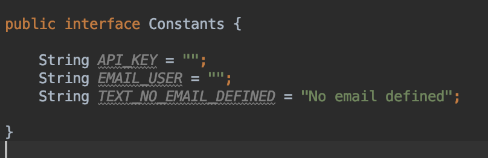

 # Tourmaline Service Example

 This is a test project of the Tourmaline Labs API.
 
 
 To use this app you must enter your api_key and user created in tourmaline, in the constants.java file

 
 
 
 
 This project is based on the example of [Tourmaline](https://github.com/tourmalinelabs/AndroidTLKitExample)
 
 
 
 The application has two buttons
    
   - The `START SERVICE` button starts the tourmaline service 
    
   - The `START SERVICE IN BACKGROUND` button starts a background service that constantly tries to start the Tourmaline service
   
 